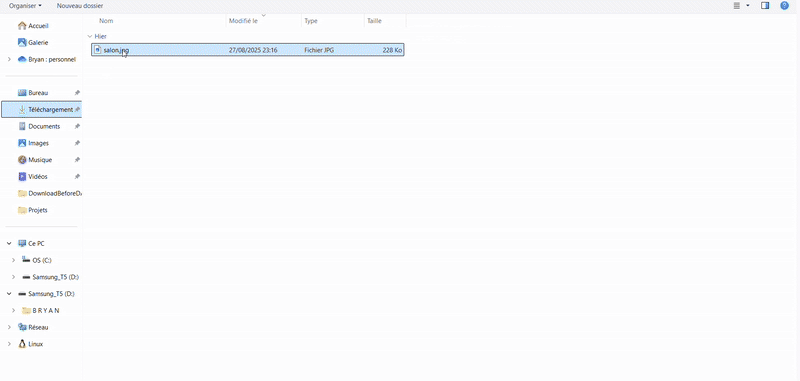

# 🛋️ AIrchitect - AI Interior Design Assistant

<p align="center">
    <picture>
        <source media="(prefers-color-scheme: light)" srcset="https://github.com/user-attachments/assets/9a4b26f0-2bff-49c4-85ab-648f41479fc2">
        
    </picture>
</p>

<p align="center">
  <a href="https://github.com/BryanBradfo/AIrchitect/actions/workflows/ci.yml?branch=main"></a>
  <a href="https://github.com/BryanBradfo/AIrchitect/releases"></a>
  <a href="LICENSE"></a>
</p>

**AIrchitect** is an interactive application that leverages Mistral AI's multi-modal model, **Pixtral**, to act as an expert interior design assistant. The application allows users to visualize how a catalog product would fit into their own living space.

---

## What is it about?

This project implements a **RAG (Retrieval-Augmented Generation)** architecture to provide personalized and contextual recommendations by combining visual information (images) with textual data (product specifications).

 <!-- A GIF is highly recommended to showcase your project! -->

## Key Features

- **Interactive Chat Interface**: A smooth and intuitive conversational experience built with Gradio.
- **Multi-modal Analysis**: Simultaneous processing of multiple images (product + user's room) and text.
- **RAG Architecture**: The model's response is augmented with product data (materials, style, etc.) for accurate and fact-based advice.
- **Simple Setup & Reproducibility**: Fully configured within a Conda environment for perfect reproducibility.
- **State-of-the-Art Model**: Powered by `mistral-community/pixtral-12b` with 4-bit quantization for efficient execution on a single GPU.

## Quick Start

Follow these steps to run the application on your local machine (NVIDIA GPU with CUDA required).

**1. Clone the Repository**
```bash
git clone https://github.com/YOUR_USERNAME/AIrchitect.git
cd AIrchitect
```

**2. Set up the Conda Environment**
```bash
# Create the environment from scratch
conda create --name airchitect_env python=3.10 -y
conda activate airchitect_env

# Install PyTorch (adjust the CUDA version to match your system if necessary)
conda install pytorch torchvision torchaudio pytorch-cuda=12.1 -c pytorch -c nvidia

# Install other dependencies from the requirements file
pip install -r requirements.txt
```

**3. Run the Application**
```bash
python app_mistral.py
```
Open the local URL provided by Gradio in your browser and start decorating!

## Tech Stack

- **LLM Model**: Mistral Pixtral-12B
- **Core Libraries**: PyTorch, Transformers (Hugging Face), bitsandbytes
- **UI Framework**: Gradio
- **Environment Management**: Conda
